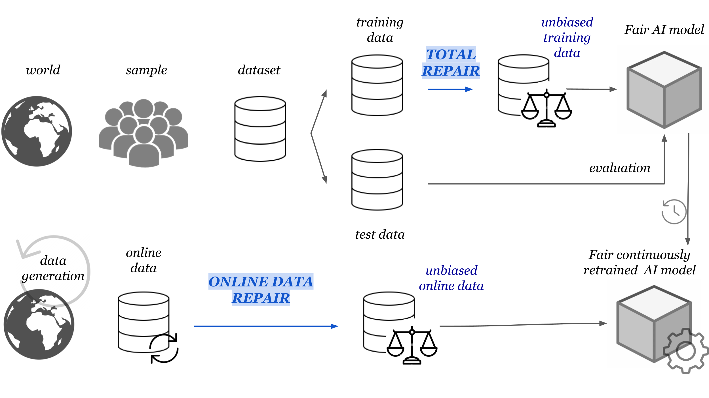
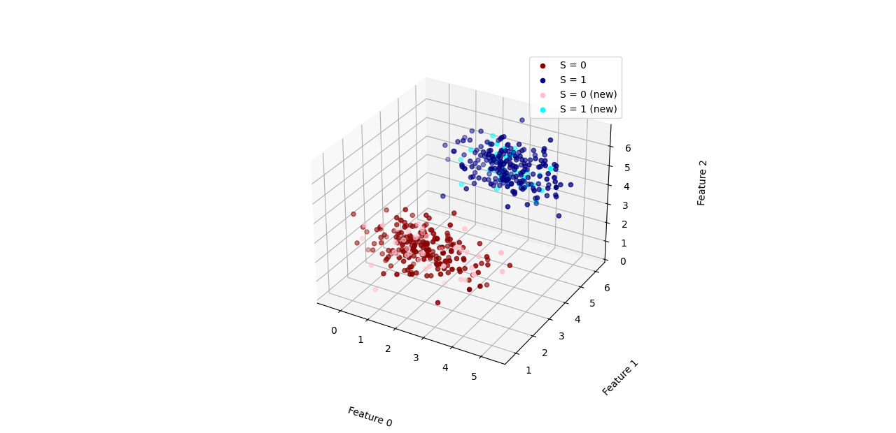
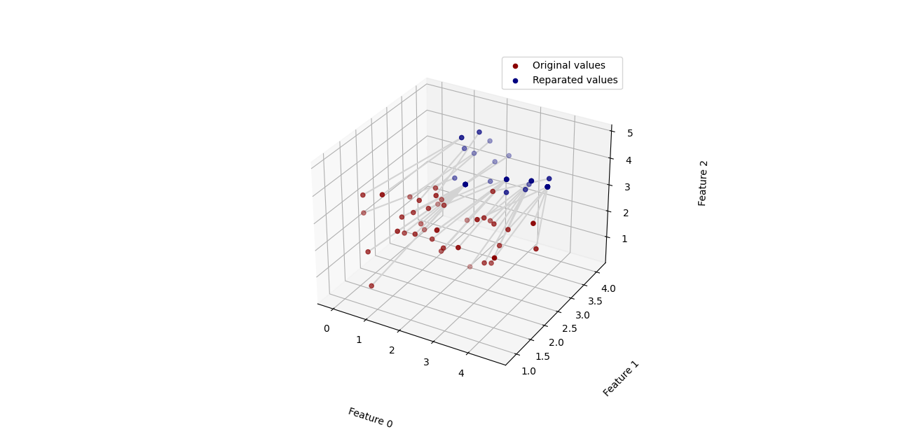
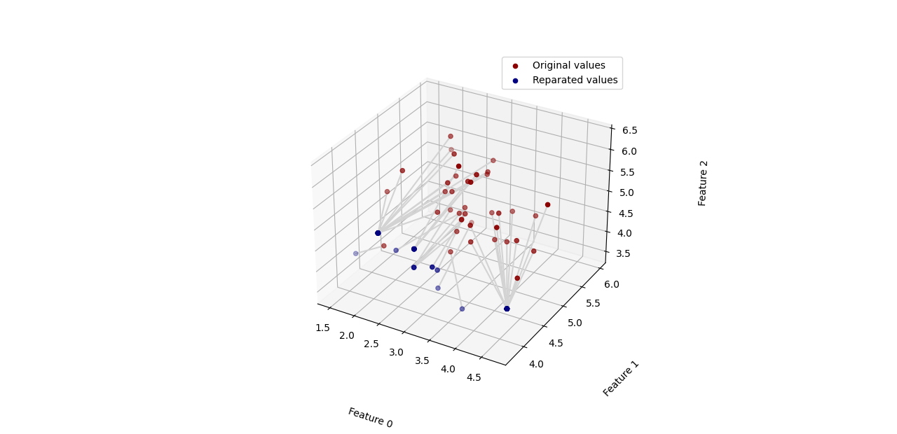

# Online-Data-Repair-Approach


Automated decision-making systems are increasingly used in various domains such as healthcare, recruitment, and justice, 
which has made the intersection between Artificial Intelligence and ethics a crucial issue in recent years. 
Fair learning has established itself as a very active area of research which tries to ensure that predictive algorithms 
are not discriminatory towards any individual at individual or group level, based on personal characteristics such as 
race, gender, disabilities, sexual orientation, or political affiliation. 
Recent statistical approaches, like \textit{total repair}, have focused on data repairing methodologies that map 
conditional distributions of each sensitive group towards their Wasserstein barycenter. 
This thesis aims to overcome the limitations associated with the existing methodology, which is data-dependent. 
The current approach utilizes a discrete optimal transport plan to compute transformed values for selected features. 
This results in a final output consisting only of a set of points and their corresponding images under a map. 
This limitation becomes particularly evident in a production Machine Learning process, where the model is retrained 
with an augmented dataset that contains new data. 
Addressing the coherence and mitigation of bias during this retraining process becomes key to ensure accurate and 
fair results. 
Our proposed novel pipeline tackles this challenge by introducing an efficient algorithm that employs a continuous 
extension of the empirical optimal transport map, based on the well-established mathematical notion of interpolation. 
This procedure has two main advantages: preserving the properties of the optimal transport map and the reduction in 
computational costs. 
An open source implementation in Python language of the algorithm is provided, and several experiments show that the 
proposed method is promising in bridging the gap between continuous and empirical transport.



## Installation

Tested on Windows (Python 3.8 and Python 3.9):

```$ pip install OnlineDataRepair```

For download it locally:

```$ git clone https://github.com/emartindedi/OnlineDataRepair.git```


## Usage

- **Directory ODR** (Online Data Repair - One dimensional data)
  - `main.py`: the function <span style="color:blue">run_OT_extension(input_min, input_def, x_0, dim = 1, grupo, opcion_rep, rtol=1e-6, maxiter=100, default_step_size=0.2)</span> 
  computes the repair value for the new point x in R.

- **Directory ODR_general_dimension** (Online Data Repair - General dimensional data)
  - `main.py`: the function <span style="color:blue">run_OT_extension_gen_dim(input_0, input_1, x, dim, grupo, opcion_rep, rtol=1e-6, maxiter=100, default_step_size=0.2)</span> 
  computes the repair array for the new point x in Rd. 

## Examples

In this section, we introduce the simulated dataset we employ to validate our proposed online repair procedure in 
general dimension.

For the purpose of data visualization, let us consider $d = 3$ as the 
dimension of the data. Let $n_{0} = 200$ and $n_{1} = 200$ the number of 
instances of each protected class obtained from two multivariate normal 
distributions on $\mathbb{R}^{3}$ with respective vector of means $\mu_{s} \in \mathbb{R}^{3}, s \in \{0,1\}$ and equal covariance matrix $\Sigma = \text{diag}(\sigma), \sigma \in \mathbb{R}^{3}$. 
In order to obtain the online data, we simulated 80 values in total, 
i.e. $n_{0, \text{new}} = 40$ and $n_{1, \text{new}} = 40$ instances of each protected 
class obtained from $\mu_{s}, s \in \{0,1\}$.


#### Total repair procedure to offline data 

Total repair procedure amount to mapping the original variable $X$ (without considering $S$) 
into a new variable $\tilde{X} = T_{s}(X)$ such that the conditional distributions with 
respect to $S$ are the same.



#### Online data
We presented the resutls of a formal procedure that requires both the original features and the transformed features 
as input data. 
The purpose of this procedure is to obtain an interpolation function capable of generating the repaired version 
of any point within the domain. 

- Group S = 0 (unfavored)
    
- Group S = 1 (favored)
    

## Dependencies

See the file `requirements.txt`.


## References

The ideas of this thesis have appeared previously in the following international conferences:

- De Diego, E. M., Gordaliza, P., López-Fidalgo, J. (2023, June 05-07). Online data repair towards demographic parity implemented in Python. In VI Scientific Congress of Young researchers in Experimental Design and Data Science (JEDE 6), Pamplona (Spain). [Conference presentation]. http://dx.doi.org/doi.org/10.15581/028.00001
- De Diego, E. M., Gordaliza, P., López-Fidalgo, J. (2023, June 08-09). An efficient Machine Learning pipeline for online data repair towards demographic parity. In 5th Bilbao Data Science Workshop, Bilbao (Spain). [Poster presentation]. http://bcamath.acc.com.es/events/bidas5/en/


## Contributors

Elena M. De Diego <emartindedi@unav.es>

Paula Gordaliza Pastor <pgordaliza@bcamath.org>

Jesús López Fidalgo <fidalgo@unav.es>

[Universidad de Navarra - DATAI](https://www.unav.edu/web/instituto-de-ciencia-de-los-datos-e-inteligencia-artificial)
